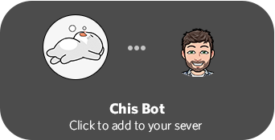
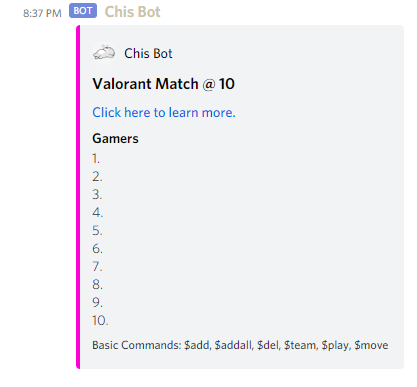
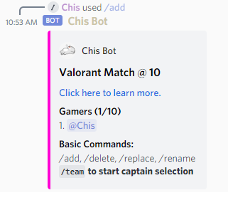
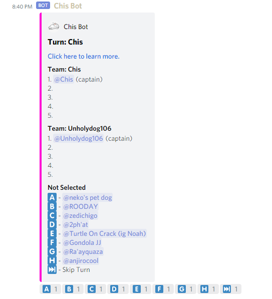
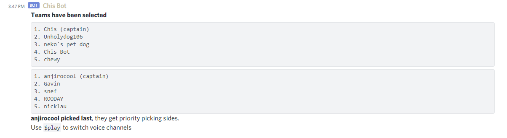
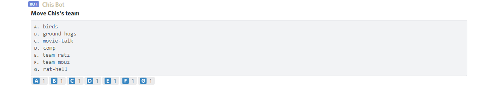
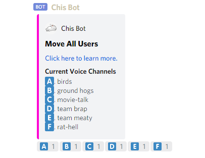

A Discord bot that provides users with a simple interface to plan pickup Valorant games.

## Usage

_Now supports Discord Slash Commands_

| Command                                    | Description                                                                       |
| ------------------------------------------ | --------------------------------------------------------------------------------- |
| [\/plan `spots` `title`](#creating-a-plan) | Takes in a number of players, creates a new game.                                 |
| /rename `title`                            | Renames the current plan.                                                         |
| /display                                   | Display plan, useful for switching text channels.                                 |
| [/add `user`](#adding-players-to-the-plan) | Add users by @tag or by typing the display name.                                  |
| /addall                                    | Add all users in the current voice channel.                                       |
| /delete `user`                             | Delete users by @tag or by typing the display name.                               |
| [/team `user`](#team-selection)            | Give a list of valid captains to start team selection.                            |
| [/play](#starting-the-match)               | Click on the letter corresponding to the correct voice channel to move each team. |
| [/move](#ending-the-game)                  | Move all players to the same voice channel, useful after match ends.              |

_Please give support to [zacharied](https://github.com/zacharied) for the wonderful [Discord React-Prompt library](https://github.com/zacharied/discord-eprompt)._

[ Link to repository](https://github.com/Chrisae9/chis-bot)

## Bot Examples

### Creating a plan

`/plan spots:10 title: Valorant Match @ 10`

This will create a plan named "Valorant Match @ 10" with 10 available spots.

### Adding Players to the Plan

`/add user:@Chis`

This will add a player to the current plan.

## Team Selection

`/team captain1:@Unholydog106 captain2:@Chis`

Start the team selection by supplying the captains for the match.

Once the team selection begins, the captain can choose the emoji letter corresponding to the player they want to have on their team.

## Starting the Match

`/play`

After the teams have been selected, run the play command to move the teams to different voice channels.

## Ending the game

`/move`

After the match has completed, the move command can be used to return everyone to the selected voice channel.

