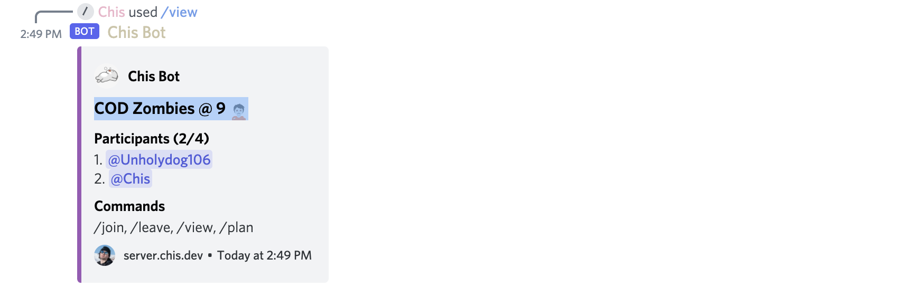

A Discord bot that orchestrates game services on `server.chis.dev`.

[ Link to repository](https://github.com/Chrisae9/chis-botjs)

## Usage

| Command                                       | Description                                        |
| --------------------------------------------- | -------------------------------------------------- |
| [\/plan `title` `spots`](#creating-a-plan)    | Takes in a number of spots, creates a new plan.    |
| /view                                         | Show plan, useful for switching text channels.     |
| [/join `member`](#adding-players-to-the-plan) | Join the plan, or specify a valid Discord Member.  |
| /leave `member`                               | Leave the plan, or specify a valid Discord Member. |
| /gather                                       | Mention all participants on the current plan       |
| /server `service` `state`                     | Start/stop a game server on `server.chis.dev`      |

## Bot Examples

### Creating a plan

`/plan title: COD Zombies @ 9 🧟 spots:4 `

This will create a plan named "COD Zombies @ 9 🧟" with 4 available spots.

### Joining the Plan

`/join member:@Chis`

This will add a member to the current plan.

