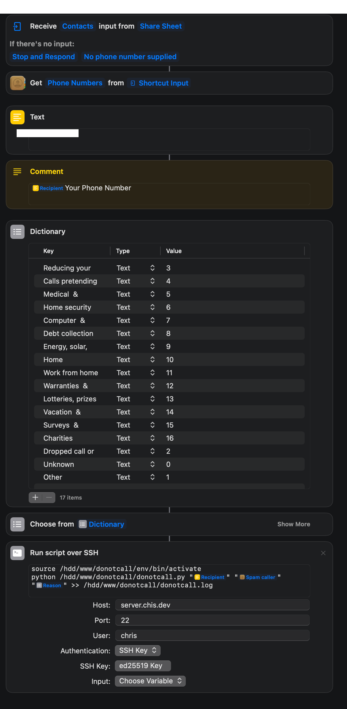

Over the past couple of years, spam calls have been a big part of my life. Almost every day I get a call stating that my car's warranty is expired or some threatening message that is supposed to make me feel like I need to fork over some money to whoever is on the other line. It's upsetting knowing that these people are successful with their lucrative businesses. Before my grandparents passed away, they were a victim of this awful scam.

Not only did I want these scammers to stop calling my phone, but I also wanted to make it so they wouldn't be able to call anyone else. Here is what I did to get scammers to stop calling my phone. It's been about a month, and I have not received any spam calls.

## Registering on the National Do Not Call Registry

Yes, it is that simple. If you don't want solicitors to call you then you can register at [donotcall.gov](https://www.donotcall.gov/). That is if they are an organization that follows rules and regulations. This is not enough to stop the scammers that I was dealing with.

## Reporting an Unwanted Call

If you get a call from an unwanted number you can submit a form on the Do Not Call Registry to get this number blacklisted. According to my knowledge, this works but it is a lengthy process that requires a decent amount of input from the user to get the form completed and submitted.

## Automating the Form

Here is a quick python script that automates the form submission using Selenium.

`gist:chrisae9/ae22a31bd5eba4a3b77e2c914af086da?file=donotcall.py&lines=30-35,43-73`

## Configuring on iOS

To run this script from an iPhone, we must create an iOS Shortcut.

## Running the Script

Whenever a call is received on my phone, I can activate the script using the share contact dialog.

Thanks for reading!
