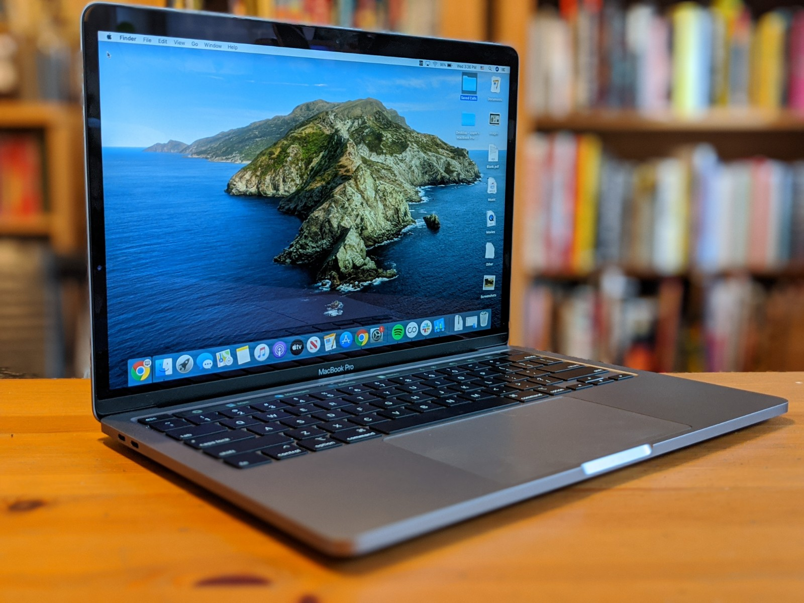

If you are like me and have never owned a Macbook but have extensive knowledge of other operating systems like Windows, Linux, and Chrome OS. Then this post might be for you.

I am mostly writing this in case I accidentally wipe my Macbook and need to recover all of the settings/modifications that I make to my device. 😎

## The Touchbar

### Default settings

If you don't love this thing then you are probably using it wrong. The first thing I did was take that god-awful Siri button off and exchange it for a shortcut to the notification center (very similar to how it is configured Chrome OS).

### Touch Switcher

I think that this is the most elegant change that you can make to the touch bar. I tried out Pock but it was just too glitchy. Some tips for this one are. I changed the shortcut to be option + space so it is easier to access from the keyboard.

## The Terminal

Not much to do here because it is already running ZSH! One thing I did do was make it so that I can use touch ID to validate elevated privileges like sudo. (Unfortunately, this doesn't work over ssh).

Add this line in `/etc/pam.d/`

`auth sufficient pam_tid.so`

And there you have it! Not much customization on my Macbook (as expected).
