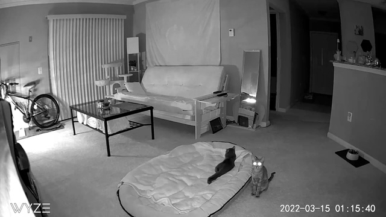

Using 2 Wyze Cams and my server I was able to set up a home surveillance system. This allows me to keep an eye on the cats during the day while they are busy at play. Even when I am not at home, I can make sure that they are having a good nap in the cat tree. (In the picture above, I swear Kiwi is possessed 👻).

## Set up the cameras

Flash the RTSP firmware on the camera. Firmware can be found [here](https://support.wyze.com/hc/en-us/articles/360026245231-Wyze-Cam-RTSP).

Navigate to the advanced settings to generate an RTSP URL. This will be used later on.

## Set up motionEye Docker Container

For this, you are going to need `docker` and `docker-compose`.  
I decided to set up a compose file just in case I need to save live video or pictures to my shared drive. 

```yaml
version: "3"
services:
  motioneye:
    image: ccrisan/motioneye:python3-amd64
    container_name: "motioneye"
    restart: "unless-stopped"
    ports:
      - 8765:8765
    volumes:
      - /etc/localtime:/etc/localtime:ro
      - /etc:/etc/motioneye
      - /media:/var/lib/motioneye
      - /run:/var/run/motion
```
I used [VSCode docker plugin](https://marketplace.visualstudio.com/items?itemName=ms-azuretools.vscode-docker) to run the build. 

Here is the equivalent command.  
`docker-compose -f "docker-compose.yaml" up -d --build`

## Hosting on the Web

Once the container is started, you should be able to open the web interface on port `8765`. After an administrator password is created, we can make the proper entry for our Nginx reverse proxy.

`/etc/nginx/sites-available/cam.chis.dev`

```
server {
    listen          80;
    server_name cam.chis.dev;

    location / {
        proxy_pass http://localhost:8765;
    }
}
```

Go ahead and add your cameras:

- Add camera
- Network camera
- Enter RTSP URL

And there you have it! A simple home surveillance system that only took an afternoon to configure. 

📸