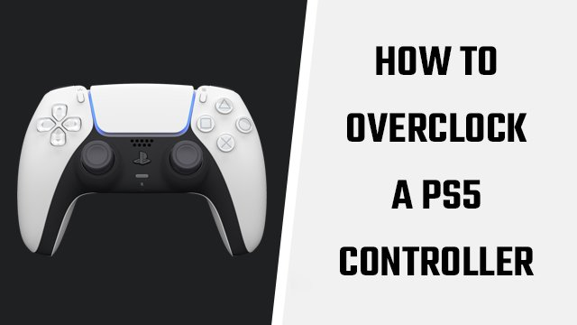

## Downloads

- [hidusbf.zip](https://share.chis.dev/hidusbf.zip)

## Process

1. Open `DRIVER -> Setup.exe`.
2. Select the “Devices” dropdown in the top left, then choose “All” from the list.

> The DualSense has a bInterval of six.
> If multiple devices have six in the bInterval column, check the “Child Name(s)” column.
> The PlayStation 5 gamepad features “(Wireless Controller)” in the name.

3. After identifying the correct device, click it.
4. Click “Install Service” at the bottom, then “Open” when prompted.
5. Tick the “Filter On Device” option.
6. Change the “Default” dropdown to the “1000” setting.
7. Unplug the PS5 controller, then plug it back in.

> The bInterval should now be one, while the “Rate” column is at 1,000.

As noted by Rocket Science, there are no known hardware side effects to overclocking console controllers. Despite that, users should be careful when selecting devices. It’s possible to inadvertently disable speakers by changing their settings, for example, which can be quite worrying. Still, it’s simple to revert back by identifying the device and restoring its default value.

Of course, it’s also possible to restore an overclocked PS5 controller back to the default settings by following the same method. Just select it from the list of input devices, untick “Filter On Device” and select “Default” from the dropdown menu. After replugging the DualSense, it will no longer be overclocked.
