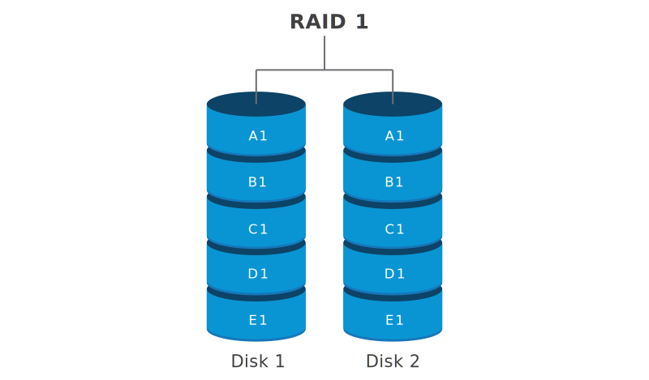
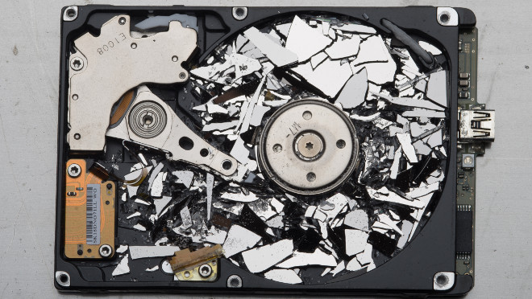
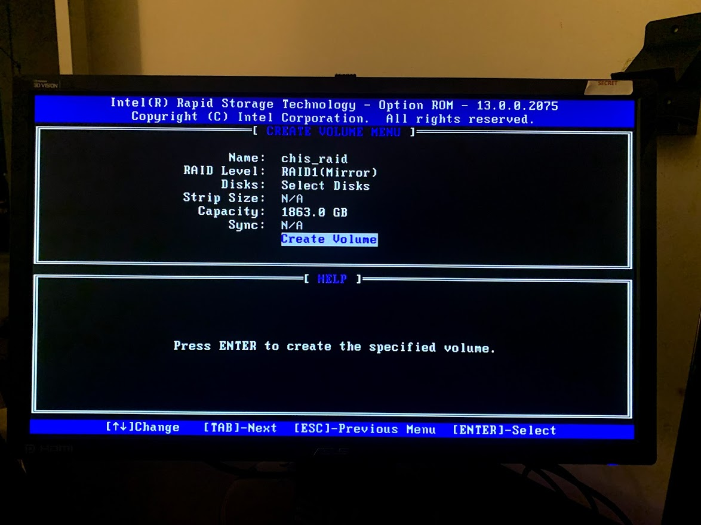

## Time to Upgrade

Since my server has been running for more than a month, I decided to upgrade the storage solution.

In the event of a hard drive disk failure I wanted to be able to keep my server up and running. To ensure data availability, I decided to setup RAID 1 using two 2TB hard drives.

## What is RAID 1?

RAID 1 is where stored data is mirrored across the two hard drives. The benefit being, if one hard drive disk fails the other is able to take over. This was important for me because I was storing all of my sensitive data on a 7+ year old Seagate hard drive that came from my first PC build back when I was in high school.



## Why I Chose RAID



After reading many articles about NAS storage I decided to go with RAID 1 for three reasons:

- **Data Redundancy:** Since I don't need an insane amount of space for my data, mirroring my data across another hard drive is not a con only a pro.

- **Read Speeds:** Having 2 drives with the same data increases the read speeds! _(Not sure if this is actually beneficial over a 1Gbit network cable)._

- **Setup Cost:** I only needed 1 extra hard drive which I was able to pick up from Microcenter for ~\$50 making RAID 1 a
  cheap solution.

## How I Setup RAID on My Server

My goal was to setup two hard drives in RAID mode while leaving my SSD untouched. This allows me to have two copies of all my important data isolating it from the operating system. My SSD will not be in RAID mode and it will be used as a boot drive. It is not important for me to backup my operating system because all of my Ubuntu settings and configuration files are managed by Ansible using a pull configuration.

### Moving the data

The existing hard drive that I had previously been using to run everything from my web sever to my Discord bot needs to formatted in order to be properly configured in RAID mode. To ensure that none of my data was lost I created an archive of all of my data and temporarily stored it on my SSD.

```bash
tar -czvf hard_drive.tar.gz /hdd
```

I was lucky that data on my hard drive was able to fit on the SSD. If I didn't have the free space I would have had to find a bigger drive to temporarily store my data.

### Enabling RAID Mode

With just a few clicks I was able to enable RAID mode in BIOS.

I installed the new hard drive into my servers bay and rebooted the PC to enter the configuration utility.



### Mounting the Drive on Linux

After the hard drives initialized in RAID I needed to get them to mount them to my file system.

#### Displaying the drive:

I had to install mdadm to help display the RAID drive:

```bash
sudo apt install mdadm
sudo mdadm --assemble --scan
sudo mdadm --detail --scan >> /etc/mdadm.conf
```

Using these commands I was able to get my RAID drive to show up as `/dev/md/chis_raid`.

#### Formatting the drive:

Before mounting the drive the filesystem needs to be converted:

```bash
sudo mkfs.ext4 /dev/md/chis_raid
```

#### Finally, Mounting the Drive:

```bash
sudo mount /dev/md/chis_raid /hdd
```

This will mount the drive to the filesystem in the correct place.

#### Persisting Mount on Boot:

In order for the mounted drive to persist on boot, a proper `/etc/fstab` entry must be created:

```bash
/dev/md/chis_raid    /hdd    ext4    defaults    0    0
```

### Restoring the Data

The RAID setup is complete, now the data must be restored to the proper place:

```bash
tar xvf hard_drive.tar.gz -C /hdd
rm hard_drive.tar.gz
```

> After system reboot, RAID should be setup!
