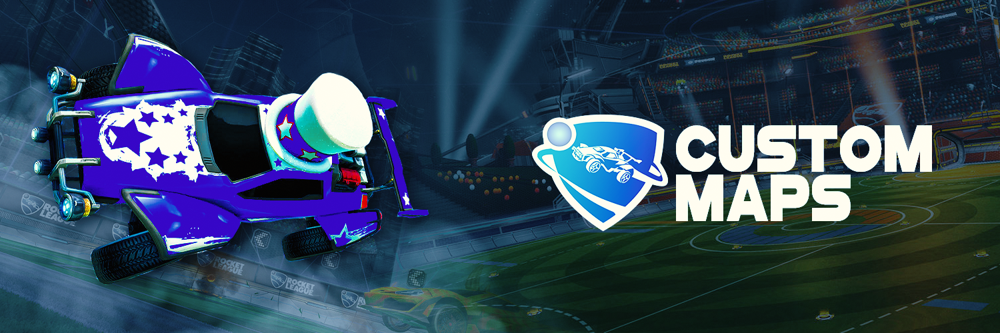
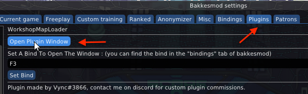
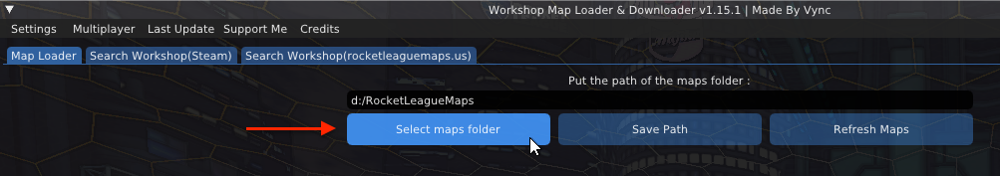
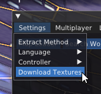
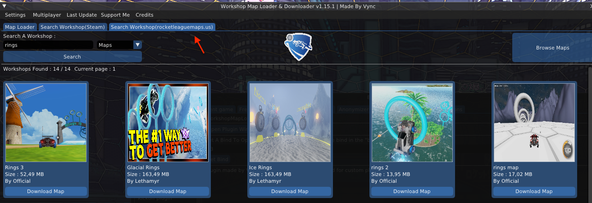
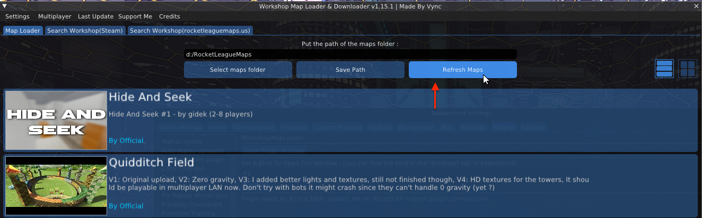

A quick tutorial for configuring Rocket League custom maps.

## Installing BakkesMod

- Install <a href="https://www.bakkesmod.com/" target="_blank">Bakkes Mod</a>
- Run the program
- Launch Rocket League **before** installing plugins.

## Installing Plugins

- <a href="https://bakkesplugins.com/plugins/view/166" target="_blank">NetCode Plugin</a>
- <a href="https://bakkesplugins.com/plugins/view/223" target="_blank">Workshop Map Downloader</a>

## Joining a Custom Game

### Finding the Workshop Map Downloader Plugin

Open BakkesMod using `F2`.   
Under Plugins find the `Workshop Map Downloader` and open the `Plugin Window`.

### Selecting a Download Location

Select a download location for the custom maps.   
This can be anywhere on your PC.

### Downloading the Additional Textures

Under the settings tap, select `Download Textures`.  
These extra files are necessary for some maps to work.

### Adding a Map to Your Library

Search for a Rocket League Map from `rocketleaguemaps.us`.  
Once you find the right map, click download.

### Loading Custom Maps

Go back to the Map Loader and click refresh to see your maps.  
Click on the map to load it.

**Note: When joining a custom game, you will be prompted to restart the Rocket League**

## Hosting a Custom Game

Forward port `7777` on router
<a href="https://www.noip.com/support/knowledgebase/general-port-forwarding-guide/" target="_blank">(How to forward a port)</a>

- Launch Rocket League.
- Open BakkesMod using `F2`.
- Switch to the Workshop Map Downloader Plugin, located under the plugin tab.
- Select correct map
- Change settings according to workshop description
- Click host new game (Restart not required)
- Share IP with friends!