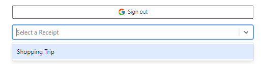
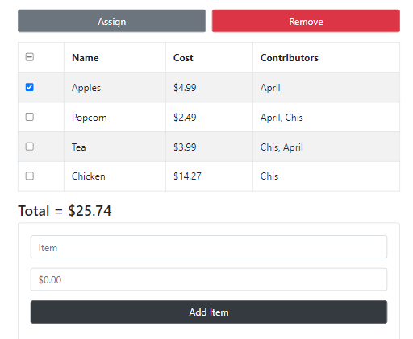
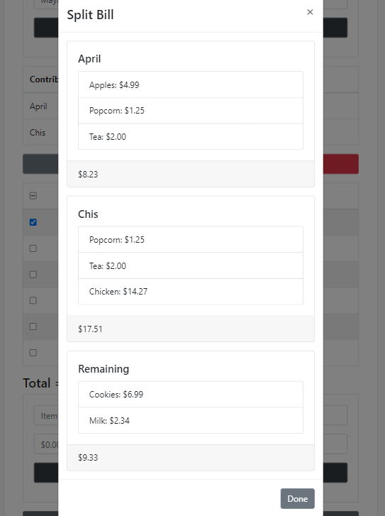

[split.chis.dev](https://split.chis.dev/)

A React application that lets users dynamically share the cost of a bill. Targeted at college students and first-time apartment renters, Split eliminates the need to do manual bill calculations while increasing bill accuracy and promoting record keeping. Unlike Venmo’s share-cost feature, Split is able to divide a receipt by each individual item. This provides users with a better interface for computing the final cost to be distributed to each collaborator.

<!--  -->

## Features

### Google OAuth 2.0 paired with MongoDB

Split provides users with a single sign-on option using [Google OAuth 2.0](https://developers.google.com/identity/protocols/oauth2). This eliminates the need to store user data in the backend. Once a user signs in with their Google account, Split will use the ID associated with their account to save and load receipts to a [Mongo database](https://www.mongodb.com/) accessible through the api located at [api.chis.dev](https://api.chis.dev).

### React Bootstrap Table 2

Split uses [`react-bootstrap-table-next`](https://react-bootstrap-table.github.io/react-bootstrap-table2/) to display the items of the bill. Giving users the ability to select table columns to assign/remove contributors.

### Cost Distribution

After the split button is pressed, Split will display a modal window with a calculated bill. This allows for contributors to see the exact cost of each item. The window will also show a box for the remaining items/total if no contributor was selected. Since each receipt can be saved for later use, the owner will be able to reload the receipt at a later date and make any neccessary changes.

[ Link to frontend repository](https://github.com/Chrisae9/split)

[ Link to backend repository](https://github.com/Chrisae9/split-backend)
