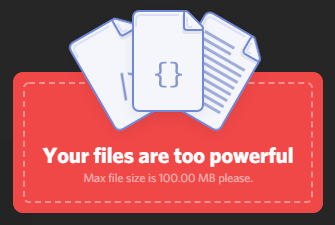
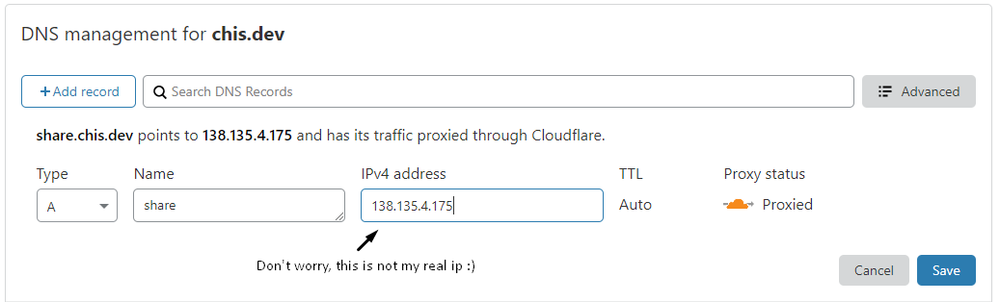
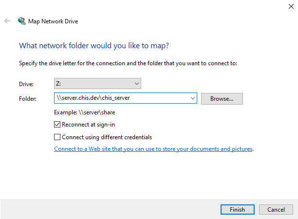
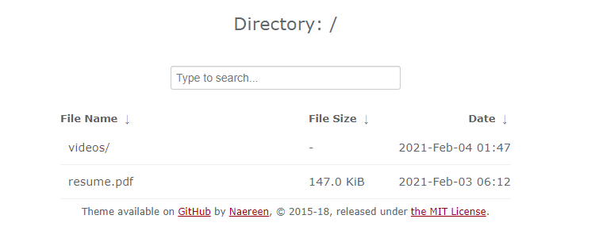
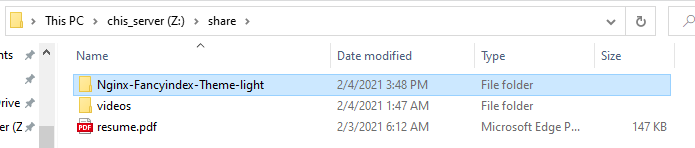
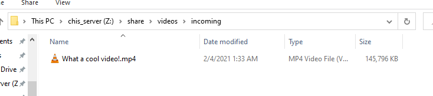
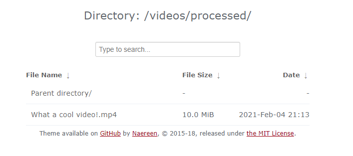

One common problem that arises is having to deal with the Discord upload limit of 100 MB. Previously, I would upload my gaming videos to [Imgur](https://imgur.com/), but ever since they enforced watching ads I can't bear waiting 10 minutes just to share a funny moment.

My solution is to host the video I want to share off of my server. In order to acheive this, I trim the video using [LosslessCut](https://github.com/mifi/lossless-cut) and drop it into a [Samba](https://www.samba.org/) shared folder. This shared folder with be hosted on my server at [share.chis.dev](https://share.chis.dev) using [Nginx](https://www.nginx.com/) paired with [Cloudflare](https://www.cloudflare.com/), once the file is dropped into that folder it is automatically converted into streaming quality using [inotify](https://man7.org/linux/man-pages/man7/inotify.7.html) with a small bash script containing an [`ffmpeg`](https://ffmpeg.org/) command.

## Create a DNS entry for the Sub-domain on Cloudflare



## Configuring Samba Server

Install Samba onto the server:

`sudo apt install samba`

Create a Samba password, this will be used to login through the client:

`sudo smbpasswd -a <user_name>`

Make a backup of the Samba config file:

`sudo cp /etc/samba/smb.conf`

Add an entry for the desired shared folder in the Samba config file:

`sudo vim /etc/samba/smb.conf`

```bash
[chis_server]
        path = /hdd
        read only = No
        valid users = chris
```

Test the Samba config file for errors:

`testparm`

```bash
Load smb config files from /etc/samba/smb.conf
Loaded services file OK.
Server role: ROLE_STANDALONE
```

Restart the Samba service:

`sudo service smbd restart`

## Mapping the Network drive on Windows

Open the file browser and navigate to `This PC` and select the `Computer` tab. Locate `Map network drive` and enter the credentials.



You should be able to view the drive on your Windows Machine, this also works on Chrome OS and iOS. For more information on how to connect the drive to other locations see [here](https://help.ubuntu.com/community/How%20to%20Create%20a%20Network%20Share%20Via%20Samba%20Via%20CLI%20%28Command-line%20interface/Linux%20Terminal%29%20-%20Uncomplicated,%20Simple%20and%20Brief%20Way!).

## Configure Nginx

Install Nginx onto the server:

`sudo apt install nginx -y`

Install firewall:

`apt install ufw`

Open and enable ssh, samba, http, and https ports.

```bash
# Make sure to allow ssh port before enabling service
ufw allow 22
ufw allow 80
ufw allow 443
ufw allow 445
ufw enable
```

Check the status of ufw

```bash
Status: active

To                         Action      From
--                         ------      ----
22                         ALLOW       Anywhere
443                        ALLOW       Anywhere
80                         ALLOW       Anywhere
445                        ALLOW       Anywhere
22 (v6)                    ALLOW       Anywhere (v6)
443 (v6)                   ALLOW       Anywhere (v6)
80 (v6)                    ALLOW       Anywhere (v6)
445 (v6)                   ALLOW       Anywhere (v6)
```

_Note: Make sure that the corresponding ports are open on your routers firewall._

Start and enable Nginx and ufw:

```bash
sudo systemctl start nginx
sudo systemctl enable nginx

sudo systemctl start ufw
sudo systemctl enable ufw
```

Create a Nginx config file:

`sudo vim /etc/nginx/sites-available/share.chis.dev`

```bash
server {
    listen          80;

    server_name share.chis.dev;
    root /hdd/share;

    location / {
        autoindex on;               # enable directory listing output
        autoindex_exact_size off;   # output file sizes rounded to kilobytes, megabytes, and gigabytes
        autoindex_localtime on;     # output local times in the directory
    }
}
```

Save and check integrity of config file:

`sudo nginx -t`

Enable the server

`sudo ln -s /etc/nginx/sites-available/share.chis.dev /etc/nginx/sites-enabled`

Restart nginx service

`sudo systemctl restart nginx.service`

## Enabling Fancy Index for Nginx



Install extras for Nginx:

`sudo apt-get install nginx-extras`

Edit the Nginx config file:

`sudo vim /etc/nginx/sites-available/share.chis.dev`

Replace the location section with:

```bash

location / {
    fancyindex on;
    fancyindex_localtime on;
    fancyindex_exact_size off;
    # Specify the path to the header.html and foother.html files, that are server-wise,
    # ie served from root of the website. Remove the leading '/' otherwise.
    fancyindex_header "/Nginx-Fancyindex-Theme-light/header.html";
    fancyindex_footer "/Nginx-Fancyindex-Theme-light/footer.html";
    # Ignored files will not show up in the directory listing, but will still be public.
    fancyindex_ignore "examplefile.html";
    # Making sure folder where these files are do not show up in the listing.
    fancyindex_ignore "Nginx-Fancyindex-Theme-light";
    # Maximum file name length in bytes, change as you like.
    # Warning: if you use an old version of ngx-fancyindex, comment the last line if you
    # encounter a bug. See https://github.com/Naereen/Nginx-Fancyindex-Theme/issues/10
    fancyindex_name_length 255;
}
```

Save and check integrity of config file:

`sudo nginx -t`

```bash
nginx: the configuration file /etc/nginx/nginx.conf syntax is ok
nginx: configuration file /etc/nginx/nginx.conf test is successful
```

Download theme folder from [Fancy Index Theme by Naereen](https://github.com/Naereen/Nginx-Fancyindex-Theme) and drop them into the root of the shared folder:



Restart the nginx service

`sudo systemctl restart nginx.service`

## Automatic Video Conversion

Install inotify:

`sudo apt install inotify-tools`

Create the video conversion script:

```bash
cd /hdd/share/videos
touch discord-converter
chmod +x discord-converter
vim discord-converter
```

```bash
#!/bin/bash

TARGET=/hdd/share/videos/incoming
PROCESSED=/hdd/share/videos/processed


inotifywait -m -e create -e moved_to --format "%f" $TARGET \
        | while read FILENAME
                do
                    while fuser "$TARGET/$FILENAME"; do
                        echo "waiting"
                    done
                    if ffmpeg -y -i "$TARGET/$FILENAME" -c:v libx264 "$PROCESSED/$FILENAME"; then
                            rm "$TARGET/$FILENAME"
                    fi
          done
```

Make the folders to recieve and process the incoming videos:

`mkdir incoming processed`

Make a discord-converter service:

`sudo vim /lib/systemd/system/discord-converter.service`

```bash
[Unit]
Description=discord.converter

[Service]
WorkingDirectory=/hdd/share/videos/incoming
Type=simple
KillMode=none
SuccessExitStatus=0 1
ExecStart=/hdd/share/videos/discord-converter
Restart=always

[Install]
WantedBy=multi-user.target
```

Enable and start the service:

`sudo systemctl start discord-converter.service`

`sudo systemctl enable discord-converter.service`

Create a URL link for easier access:

`touch /hdd/share/videos/Processed\ Video\ Link.url`

```bash
[InternetShortcut]
URL=https://share.chis.dev/videos/processed
```

Test by dropping a file into the folder:



Wait for the video to process and it should be available on [share.chis.dev/videos/processed](https://share.chis.dev/videos/processed)


