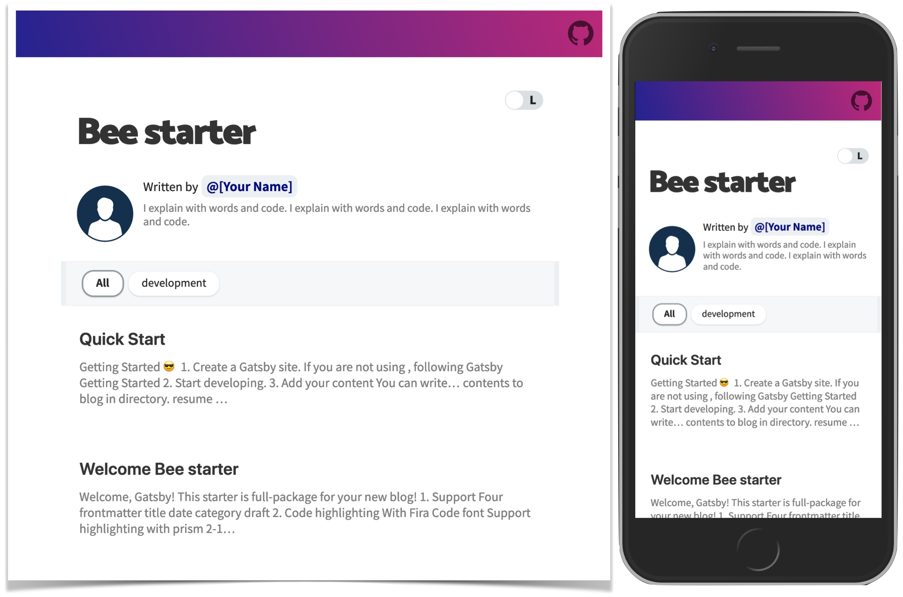

Creating a blog is a form of documentation, it allows you to write about things that don't necessarily belong in a GitHub README. It shows others your progress, serving as a record keeper for all of the things you find important. It is your home on the internet.

My goal of this project was not learn web development, but to jumpstart my first blog. After searching the internet for a while, I came across [Gatsby](https://www.gatsbyjs.com/) which seemed like it would provide the best interface for getting a website up quickly. I decided to use [Gatsby Starter Bee](https://github.com/JaeYeopHan/gatsby-starter-bee) which was a very simple but elegant blog template.

## Creating the Website



First clone the starter repository:

```bash
npm install -g gatsby-cli
gatsby new my-blog-starter https://github.com/JaeYeopHan/gatsby-starter-bee
```

Run the project:

```bash
cd my-blog-starter/
npm start
```

## Modifying the Template

There were some things that didn't fit my style in the template. Even though the goal of this project was to get a website up and running, I wanted to personalize it to my liking.

### Editing the Meta Data

Fill in the `gatsby-meta-config.js` at the top of the source tree. I decided not to use Google Analytics so I put a `"1"` in the field to bypass the application errors.

I do not have a Meduim account so I decided to replace it with YouTube.

Find all references of Medium and replace with YouTube. They should be in the `gatsby-meta-config.js` and the `src/components/bio/index.jsx` files.

### Changing the color

Edit the `src/styles/variables.scss` file to change the colors of the top gradient:

```scss
$theme-gradient: linear-gradient(72deg, #2a5470, #4c4177);
$top-header-text-color: rgb(255, 255, 255);
```

I was able to invert the color of the GitHub icon by applying a svg filter in `src/components/social-share/index.scss`:

```scss
.github-icon {
  filter: invert(100%);
}
```

### Resizing the page

I personally did not like how squished the default starter page looks. I was able to extend the page to be longer by editing the `src/layout/index.jsx` file:

```js
    <React.Fragment>
      <Top title={title} location={location} rootPath={rootPath} />
      <div
        style={{
          marginLeft: `auto`,
          marginRight: `auto`,
          maxWidth: rhythm(40), // expand here
          padding: `${rhythm(1)} ${rhythm(3 / 4)}`,
        }}
```

### Removing Light/Dark Mode

I like the idea of having a website that dynamically changes colors with a switch but it didn't fit my design style. I ran into too many issues where the
theme wouldn't match the images I uploaded and the page would only be half 'dark theme'. Therefore, I just removed the functionality.

Comment out the switch in the `src/components/theme-switch/index.jsx` file:

```js
return <div className="switch-container">{/* <label htmlFor="normal-switch">
        <Switch
          onChange={handleChange}
          checked={checked}
          id="normal-switch"
          height={24}
          width={48}
          checkedIcon={
            <div className="icon checkedIcon">
              <MoonIcon />
            </div>
          }
          uncheckedIcon={
            <div className="icon uncheckedIcon">
              <SunIcon />
            </div>
          }
          offColor={'#d9dfe2'}
          offHandleColor={'#fff'}
          onColor={'#999'}
          onHandleColor={'#282c35'}
        />
      </label> */}</div>
```

### Creating a Blog Post

The main reason I like this template is because I get to write my posts in Markdown! The default way to create a post is to run `npm run post`. I decided to not use this functionality because this will create a folder to store each blog post by category. While this seems like a good idea for organization, it adds a uneccessary paths to the URL.

For example:

`chis.dev/server/minecraft`

When I'd rather have...

`chis.dev/minecraft`

To fix this issue I just create a Markdown file in the `content/blog` directory with this header:

```Markdown
---
title: Title
date: 2020-12-20 05:02:38
category: category
draft: false
---
```

And put any images I need in the `content/blog/images` folder.

### Hosting on the Web

To buid the website run `gatsby build`

Here is my nginx configuration used to host the website on my server:

```bash
server {
    listen          80;

    server_name chis.dev;
    root /hdd/www/chis-website/public;

    location / {
        index index.html;
    }

}
```
